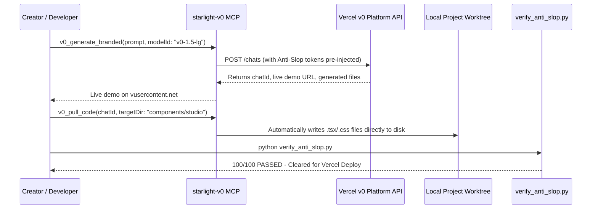

# The Sovereign Creator & AI Architecture Playbook (2026)

**Audience**: AI Architects, Creative Founders, Digital Artists, Next.js Engineers, and Creators.  
**Canonical Repository**: [`starlight-design-intelligence`](file:///C:/Users/frank/starlight/repos/starlight-design-intelligence)  
**Standard**: Anti-Slop 2026 & Apple-Grade Sovereign Web Experiences.

---

## 1. Executive Doctrine: The 10 Principles of Anti-Slop Web Architecture

1. **Obsidian Canvas Base**: Never build on generic gray or pure flat `#000000`. Use deep liquid obsidian (`#090a0f`) with subtle multi-layer HSL radial lighting.
2. **Noise Grain Integration**: Eliminate the sterile, plastic "AI look" by applying a $4.5\%$ opacity fractal SVG noise texture overlay (`.bg-grain`).
3. **Optical Typography**: Use curated font pairings (`Syne` / `Bricolage Grotesque` for display; `Space Grotesk` / `Plus Jakarta Sans` for body; `JetBrains Mono` for code).
4. **Zero All-Caps Headlines**: Display headlines must be **Sentence case**. Reserve uppercase strictly for 10–11px metadata tags with `letter-spacing: 0.12em`.
5. **Generous Spatial Breathing Room**: Body line-height must be $1.6$; display line-height must be $1.12\text{--}1.2$. Never cramp typography.
6. **Tactile Glowcards & Radial Spotlights**: Interactive cards compute cursor coordinates (`--mouse-x`, `--mouse-y`) to render mouse-following radial borders.
7. **No Emoji UI Icons**: Strict mandate for clean SVG vector icons (Lucide React, Heroicons, Simple Icons).
8. **Physics-Based Spring Transitions**: Micro-interactions must use natural easing curves (`cubic-bezier(0.16, 1, 0.3, 1)`) with $80\text{--}160\text{ms}$ hover response times.
9. **Accessibility & Reduced Motion**: Every animated surface must respect `@media (prefers-reduced-motion)` and WCAG 2.2 contrast standards ($4.5:1$ minimum).
10. **Non-Bypassable Automated Gates**: Every component must score **$100/100$** on `verify_anti_slop.py` before production promotion.

---

## 2. The Upgraded `starlight-v0` MCP Engine

Our custom MCP server ([`starlight-v0-mcp.mjs`](file:///C:/Users/frank/starlight/tools/v0-mcp/starlight-v0-mcp.mjs)) transforms raw Vercel v0 generation into an autonomous design pipeline:



---

## 3. Dynamic Multi-Model Swarm Routing Matrix

| Task Dimension | Recommended Frontier Model | Key Rationale |
| :--- | :--- | :--- |
| **System Architecture & 2M Context** | **Gemini 3.7 Flash** | $340+\text{ t/s}$ throughput, massive context window, multimodal vision QA. |
| **Apex Craft & Editorial Review** | **Claude Opus 5** | Frontier judgment, nuance detection, voice calibration. |
| **AST Code Generation & Refactoring** | **GPT-5.6 Sol** | Precise TypeScript typing, Next.js 15 App Router conventions. |
| **Branded UI Generation** | **starlight-v0 MCP (`v0-1.5-lg`)** | Rapid Next.js/Tailwind/shadcn prototyping with live demo links. |
| **Real-Time Web & Adversarial Checks** | **Grok 4.6** | Real-time X/web knowledge access and red-team validation. |

---

## 4. Production CLI Verification Guide

To scan any frontend directory across the estate:

```bash
# 1. Run the Starlight Anti-Slop Visual QA Scanner
python C:\Users\frank\starlight\repos\starlight-design-intelligence\scripts\verify_anti_slop.py <path-to-target-directory>

# 2. Expected Output
[PASS] (+15) Web fonts (Google Fonts/Fontshare/@font-face) detected.
[PASS] (+15) SVG noise/grain texture overlay detected.
[PASS] (+10) Glassmorphism / backdrop-filter blur detected.
[PASS] (+10) Micro-interactions and hover transitions detected.
============================================================
[SCORE] Anti-Slop Quality Score: 100/100
[VERDICT] PASSED - World-Class Visual Standards Cleared!
```

---

## 5. Live Showcase Components

- [CreatorStudioHero.tsx](file:///C:/Users/frank/starlight/repos/starlight-design-intelligence/examples/CreatorStudioHero.tsx) — Flagship liquid obsidian hero component.
- [CreatorWorkflowEngine.tsx](file:///C:/Users/frank/starlight/repos/starlight-design-intelligence/examples/CreatorWorkflowEngine.tsx) — Interactive multi-agent pipeline builder.
- [CSS_ANTI_SLOP_STARTER.css](file:///C:/Users/frank/starlight/repos/starlight-design-intelligence/CSS_ANTI_SLOP_STARTER.css) — Reusable CSS starter kit.
