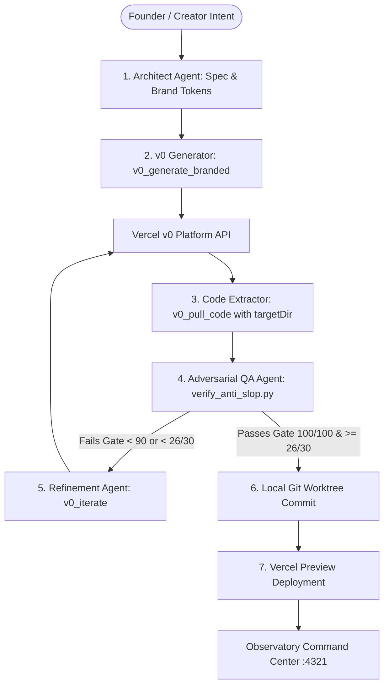

# Starlight Multi-Agent v0 Design Factory & Living Template Engine (2026)

**Canonical Location**: `starlight-design-intelligence/MULTI_AGENT_V0_DESIGN_FACTORY.md`  
**Purpose**: Multi-agent design orchestration using `starlight-v0` MCP, automated iterative refinement, living template versioning, and fleet-wide site execution across the Starlight Estate.

---

## 1. Multi-Agent Design Swarm Architecture

The design factory operates as a 5-role closed-loop swarm where no single agent works in isolation:



### Swarm Roles & Responsibilities

| Role | Primary Model / Harness | Responsibility |
| :--- | :--- | :--- |
| **1. Architect Agent** | Gemini 3.7 Flash / Claude Opus 5 | Analyzes requirements, chooses archetype template, injects Brand Pack (colors, font matrix, voice), and drafts the page component spec. |
| **2. v0 Generator** | `starlight-v0` MCP (`v0-1.5-lg` / `v0-gpt-5`) | Executes prompt with Starlight Anti-Slop preamble and produces the cloud UI prototype on `vusercontent.net`. |
| **3. Code Extractor** | `starlight-v0` MCP (`v0_pull_code`) | Directly writes all generated `.tsx` and `.css` files into the project worktree (`targetDir`). |
| **4. Adversarial QA Agent** | Automated Python AST + Claude Sonnet | Runs `verify_anti_slop.py`, checks responsive breakpoints (375/768/1440px), verifies WCAG contrast, and scores the 30-point gate. |
| **5. Refinement Agent** | `starlight-v0` MCP (`v0_iterate`) | Identifies visual defects, formulates targeted CSS/TSX adjustment prompts, and iterates in v0 until $100/100$ score is achieved. |

---

## 2. Living Template Archetypes (Planned & Refined Over Time)

Rather than generating throwaway pages, the estate maintains 5 canonical living templates with continuous versioning ($v1 \to v2 \to v3$):

```
+-----------------------------------------------------------------------------------+
|                           STARLIGHT LIVING TEMPLATES                              |
+-----------------------------------------------------------------------------------+
| [T1: Sovereign Flagship SaaS]      | [T2: AI Architect & Research Hub]            |
| - Liquid Obsidian (#090a0f) base   | - Interactive Prompt Library                 |
| - Hero spotlight & radial glowcards| - Live Model Arena telemetry                 |
| - Bento feature grid & pricing     | - Knowledge graph & field guides             |
+------------------------------------+----------------------------------------------+
| [T3: High-Ticket Product & Course] | [T4: Cinematic Lore & World Portal]          |
| - Conversion-focused module tree   | - Character forge & lore vault               |
| - Dynamic social proof ticker      | - Faction reveals & ambient WebGL / video    |
| - Sticky glass checkout drawer     | - Audio-visual narrative immersion           |
+------------------------------------+----------------------------------------------+
| [T5: Sovereign Operations Pane / Dashboard]                                       |
| - Real-time node telemetry & agent state                                          |
| - Dark-mode data tables, logs stream, and fleet health indicators                 |
+-----------------------------------------------------------------------------------+
```

---

## 3. Fleet Site Generation & Deployment Pipeline

A standardized execution loop to generate, refine, and deploy across any estate domain:

```bash
# STEP 1: Claim Lane in Queen Coordination Board
# Edit C:\Users\frank\starlight\queen\COORDINATION.md with target scope

# STEP 2: Generate Branded Archetype with starlight-v0 MCP
call_mcp_tool("starlight-v0", "v0_generate_branded", {
  prompt: "Archetype T1 for frankx.ai: Sovereign AI Creator Studio with liquid glass cards, interactive glowcard nodes, and real-time telemetry",
  modelId: "v0-1.5-lg"
})

# STEP 3: Pull Code Directly into Target Worktree
call_mcp_tool("starlight-v0", "v0_pull_code", {
  chatId: "<returned_chat_id>",
  targetDir: "C:/Users/frank/starlight/repos/frankx.ai-vercel-website/components/studio"
})

# STEP 4: Run Automated Anti-Slop Visual QA Gate (Must Score 100/100)
python C:\Users\frank\starlight\repos\starlight-design-intelligence\scripts\verify_anti_slop.py C:\Users\frank\starlight\repos\frankx.ai-vercel-website

# STEP 5: If Score < 90, Send Self-Healing Iteration
call_mcp_tool("starlight-v0", "v0_iterate", {
  chatId: "<chat_id>",
  message: "Fix anti-slop finding: Replace generic from-purple-to-blue gradient with subtle cyan-to-violet HSL lighting and add SVG noise overlay (.bg-grain)."
})

# STEP 6: Commit to Branch & Deploy Vercel Preview
git add components/studio
git commit -m "feat(studio): deploy sovereign creator studio via v0 design factory"
```

---

## 4. Multi-Brand Token Ingestion Matrix

Each target site automatically injects its corresponding Brand Pack:

| Brand / Site | Base Color | Primary Accents | Typography Pairing | Signature Character |
| :--- | :--- | :--- | :--- | :--- |
| **FrankX (`frankx.ai`)** | `#090a0f` | Gold `#f59e0b`, Cyan `#06b6d4` | `Syne` + `Space Grotesk` | Sovereign intelligence, humble authority |
| **Arcanea (`arcanea.ai`)** | `#05070e` | Violet `#8b5cf6`, Emerald `#10b981` | `Cinzel` / `Syne` + `Inter` | Mythic sci-fi, Ten Gates, luminous energy |
| **Rova Resort (`rova.com`)** | `#0a0b0d` | Champagne `#e2d9c2`, Slate `#64748b` | `Instrument Serif` + `Plus Jakarta` | Ultra-luxury hospitality, tranquil elegance |
| **SolarCarport (`solarcarport.tech`)** | `#080c10` | Solar Emerald `#10b981`, Sky `#0284c7` | `Outfit` + `Space Grotesk` | Clean energy infrastructure, technical precision |
