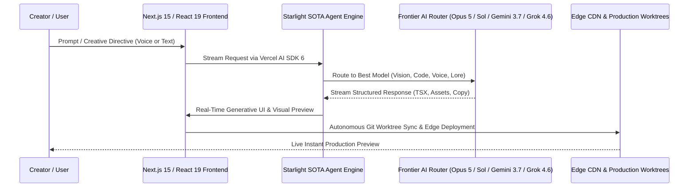

# Premium Creator Live Experience Specification (2026)
**Canonical Location**: `starlight-design-intelligence/PREMIUM_CREATOR_EXPERIENCE_2026.md`  
**Target Audience / ICP**: High-agency creators, AI architects, digital artists, modern founders, and creative technologists.  
**Quality Bar**: Apple-grade aesthetic excellence, frictionless real-time responsiveness, zero AI clichés.

---

## 1. Ideal Creator Profile (ICP) & Experience Mandates

### Who is the Ideal Creator?
The Starlight/FrankX/Arcanea creator is an autonomous, high-taste builder who demands:
- **Instantaneous Real-Time Feedback**: Zero lag, streaming AI responses, smooth 60fps micro-interactions.
- **Atmospheric Visual Depth**: Deep obsidian palettes (`#090a0f`), subtle glassmorphism with 1px liquid borders (`rgba(255,255,255,0.08)`), and organic SVG noise textures that eliminate flat digital feels.
- **Flawless Optical Typography**: Curated Google/Fontshare pairings (`Syne` / `Bricolage Grotesque` display + `Space Grotesk` / `Inter` body + `JetBrains Mono` code), generous breathing room (1.6 line height), sentence-case headlines (never aggressive all-caps).
- **Seamless End-to-End Tech**: Complete flow from prompt/idea -> multi-model generation -> code/asset extraction -> multi-channel distribution.

---

## 2. End-to-End Architecture & Data Flow

---

## 3. Visual & Aesthetic Design System (Anti-Slop 2026)

### Tokens & Colors
* **Obsidian Canvas Base**: `#090a0f`
* **Glass Surface**: `rgba(18, 20, 29, 0.75)` with `backdrop-filter: blur(16px)`
* **Liquid Accent Glows**:
  * **Cyan Flare**: `#06b6d4` (`rgba(6, 182, 212, 0.35)`)
  * **Violet Nebula**: `#8b5cf6` (`rgba(139, 92, 246, 0.35)`)
  * **Emerald Pulse**: `#10b981` (`rgba(16, 185, 129, 0.30)`)
* **Noise Grain Overlay**: $4.5\%$ opacity fractal noise overlay preventing digital flatness.

### Interaction Physics & Motion
* **Hover Curves**: $80\text{--}160\text{ms}$ ease-out with dynamic cursor radial spotlight tracking.
* **Panel Transitions**: $180\text{--}320\text{ms}$ with spring easing `cubic-bezier(0.16, 1, 0.3, 1)`.
* **Mobile-First Dynamic Sizing**: $100\text{dvh}$ container sizing, $48\text{px}$ touch targets, sticky glass navigation.

---

## 4. Quality Verification & Non-Bypassable Gates

Before promoting any creator experience to production:
1. **Automated Anti-Slop Scan**: Must achieve **$\ge 90/100$** via `verify_anti_slop.py`.
2. **Visual QA Gate**: Must score **$\ge 26/30$** on `OUTCOMES.md`.
3. **Accessibility**: Full `prefers-reduced-motion` and WCAG 2.2 contrast compliance.
