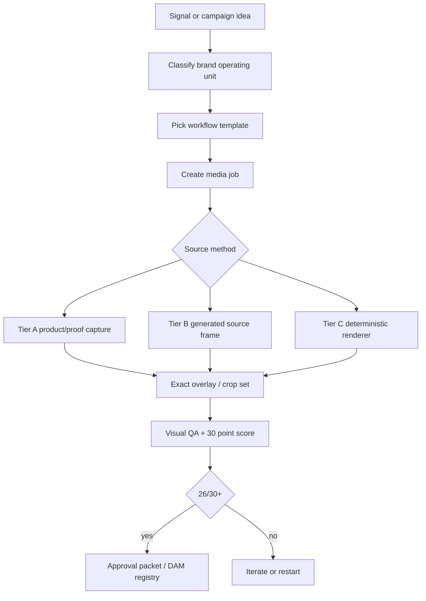

# Visual Template Routing Cheat Sheet

Date: 2026-07-04

Purpose: decide which visual templates and workflows to use for each Starlight/FrankX/Arcanea business unit, without letting agents improvise off-brand images.

## Verdict

Use the existing template system, but route it more strictly:

- **FrankX Demand** should use the mature renderer-backed social-static and infographic system now.
- **Starlight/SIS** should use website-hero, website-header, product-proof, and infographic templates for command centers, governance maps, and observability proof.
- **Arcanea** should use website-hero, motion-source-frame, brand-world poster, and controlled social-static templates, with exact text rendered outside image generation.
- **GenCreator / Creator Systems** should use product-proof, carousel, infographic, and website-header templates, but needs a central compiled brand pack before scaling.
- **AI CoE / Enterprise AI** should use deterministic infographic, deck-slide, website-header, and product-proof templates first. Avoid cinematic generation unless it supports a real framework.
- **Agentic Income** should use offer-path, revenue-engine, proof-ladder, and deterministic social-static templates. No generated money/status imagery and no unverifiable numbers.
- **Tooling / OSS** should use real code capture, CLI flow, README/social preview, OG image, and install-path diagrams. No fake terminals.
- **AnimeLegends** should stay in source-frame and character/world reference workflows until the brand pack is compiled. Do not use generic anime wallpaper as a template.

## Template Inventory Checked

| Template or workflow | Current source | Use now? | Best use |
| --- | --- | --- | --- |
| Media job brief | `brand-image-system/templates/media-job.md` | Yes | Required intake for serious visual jobs. |
| Media job JSON | `C:/Users/frank/brands/image-system/templates/media-job.template.json` | Yes | Machine-readable job packet for generated/captured assets. |
| Design evidence | `design-agent-standards/templates/design-loop-evidence.json` | Yes | QA proof, asset tier, score, decision. |
| Social static | `runtime/workflows/social-static/workflow.json` | Yes | Square, 4:5, 9:16, OG, LinkedIn/X/Instagram static assets. |
| Website hero | `runtime/workflows/website-hero/workflow.json` | Yes | First viewport hero visuals, product proof, high-craft generated base plus deterministic overlay. |
| Website header | `brand-image-system/runtime/workflows/website-header/workflow.json` | Yes | Section banners, route headers, campaign headers, OG reuse. |
| Infographic | `runtime/workflows/infographic/workflow.json` | Yes | Architecture, systems, comparisons, proof maps. Deterministic labels required. |
| Social-card renderer | `runtime/renderers/social-card/index.html` | Yes, but refactor | Strong FrankX seed; split tokens/content so it can serve multiple brands. |
| v0 scene brief | `starlight-agent-config/core/loops/v0-command-center/premium-scene-brief.template.md` | Yes | v0 frontend direction packets and premium scene contracts. |
| v0 prompt packs | `starlight-agent-config/core/loops/v0-command-center/v0-prompt-packs.md` | Yes | v0 should draft layouts/components, not final claims or exact infographics. |
| Command-center card | `starlight-agent-config/core/loops/v0-command-center/command-center-card.template.md` | Yes | Project management handoff card for Command Center. |
| Approved FrankX variants | `C:/Users/frank/brands/image-system/frankx/approved/2026-07-02-platform-variants/` | Yes | Current best reusable proof of multi-crop template quality. |
| Multi-brand seed batch | `C:/Users/frank/brands/image-system/review/multi-brand-seed-batch-contact-sheet-20260702.png` | Source frames only | Good aesthetic direction, not final templates without overlays/proof. |

## Brand And Business Routing

| Brand/business | Primary templates | Best surfaces | Source method | Do not use |
| --- | --- | --- | --- | --- |
| FrankX Demand | `social-static`, `infographic`, `website-header`, `website-hero`, `OG image` | LinkedIn/X/IG proof cards, blog hero, YouTube thumb, website OG, offer pages | Generated physical-system base + deterministic overlay; product/workflow capture when available | Cute bots, Arcanea mythic language, fake dashboards, soft startup gradients |
| Starlight/SIS | `website-hero`, `product-proof`, `infographic`, `website-header`, `motion-source-frame` | Command Center, observability, governance, protocol maps, repo/system diagrams | Real UI proof, browser capture, exact diagrams, restrained generated source frames | Neon hacker visuals, random node clouds, generic sci-fi dashboards |
| Arcanea | `website-hero`, `social-static`, `motion-source-frame`, `brand-world poster`, `website-header` | Brand worlds, creator forge pages, academy/program pages, lore/product launches | Art-directed generated world frames + precise overlays; Figma/Remotion for motion source | Purple cliche, cosplay fantasy, unreadable sigils/text, vague portals with no product evidence |
| GenCreator / Creator Systems | `product-proof`, `social-carousel`, `infographic`, `website-header`, `social-static` | Creator OS, cohorts, creator stack maps, template kits, product proof | Deterministic diagrams and product captures first; generated source frames for warmth | Generic creator desk clutter, fake social UI, influencer stock-photo styling |
| AI CoE / Enterprise AI | `infographic`, `deck-slide`, `website-header`, `product-proof`, `OG image` | Consulting pages, operating model, governance map, executive decks, LinkedIn diagrams | Code/Figma/Canva/Satori diagrams; browser captures for proof | AI hype, glowing brains, robots, fake proof, decorative node clouds |
| Agentic Income | `infographic`, `social-static`, `website-header`, `offer-path`, `revenue-engine map` | Offer pages, launch posts, revenue workflows, checkout/product pages | Exact overlays for numbers; generated base may show physical pipeline/conveyor metaphor | Money piles, luxury cars, get-rich-quick signals, fake income metrics |
| Reality Architect | `infographic`, `website-hero`, `motion-source-frame`, `social-static` | Decision architecture, transformation maps, reflective systems, programs | Deterministic life/system maps plus controlled atmospheric posters | Generic cosmic surrealism, self-help stock imagery, fake dashboards |
| Research / Mind Intelligence | `infographic`, `website-header`, `research-to-content`, `OG image` | Research syntheses, knowledge maps, mind-system pages, newsletter visuals | Source-backed diagrams, exact citations/labels, archive/lab metaphors | Fake citations, generic blue brain imagery, medical/science claims without source checks |
| Tooling / OSS | `product-proof`, `OG image`, `infographic`, `README/social preview`, `CLI flow` | GitHub repo cards, install docs, release posts, CLI demos | Real terminal/code capture, deterministic renderer, browser screenshots | Fake terminal text, fake stars/badges, generated code snippets |
| VibeClubs | `social-static`, `website-header`, `event poster`, `9:16 story/reel cover` | Events, community rituals, club identity, culture posts | Art-directed event/world source frame + exact event overlays | Generic party stock, blurry crowds, fake event text |
| AnimeLegends | `character reference`, `episode poster`, `motion-source-frame`, `brand-world poster` | Media IP development, episode/social posters, lore assets | Character sheets and source frames with strict repo-local IP rules | Generic anime wallpaper, inconsistent characters, pseudo-Japanese text, unlicensed likenesses |

## Recommended Priority Order

1. **FrankX social-static renderer loop**
   - Promote the approved `frankx-platform-variants` pattern as the template benchmark.
   - Refactor `social-card/index.html` into a token/content driven renderer.
   - Produce five repeatable modules: command layer, AI stack comparison, creator revenue flywheel, refresh queue, website/social compounding.

2. **SIS command and governance template set**
   - Build `website-hero` and `infographic` variants for Command Center, agent observatory, v0/Codex/GitHub/Vercel loops, memory/governance, and project proof.
   - Use real Observatory/Command Center captures as Tier A proof whenever possible.

3. **Arcanea cinematic source-frame system**
   - Use generated frames for creative forge, codex, portal, sigil, and world-engine scenes.
   - Add deterministic overlays, product/tool proof, or motion-source framing before publishing.

4. **Enterprise AI / AI CoE diagram pack**
   - Build deterministic operating-model maps, governance boards, and implementation blueprints.
   - Use this for LinkedIn, decks, landing sections, and sales collateral.

5. **GenCreator and Agentic Income conversion packs**
   - GenCreator: creator stack maps, cohort artifact boards, product captures.
   - Agentic Income: offer paths, proof ladders, funnel mechanics, checkout flows.
   - Both need exact overlays and claim-risk checks.

6. **Compile missing central brand packs**
   - Agentic Income, Tooling/OSS, Research/Mind, AnimeLegends, and fuller GenCreator should be compiled into `runtime/brands`.
   - Local provisional guides are useful but not enough for scaled agent production.

## Which Templates To Give v0

Give v0:

- Scene briefs for website hero/header and premium app surfaces.
- Brand pack excerpts: visual world, copy posture, do-not-use list, asset tier.
- Screenshots/product captures as context for layout direction.
- Component intentions: proof rail, command nav, mechanism panel, CTA band, social/OG frame.
- One brand at a time with one surface at a time.

Do not give v0:

- Huge cross-brand strategy dumps.
- Exact final social text, factual diagrams, or claim-heavy infographics as image-rendering tasks.
- Medical/financial/legal/high-stakes claims without source packets.
- Logo finalization tasks. Logos stay vector-first.
- Generic prompts like "make it premium" without a media job and brand pack.

## Template Production Rules

## Use / Avoid By Asset Type

| Asset type | Use | Avoid |
| --- | --- | --- |
| Hero visual | Product proof, browser capture, strong generated poster, WebGL only with fallback | Abstract gradients, fake dashboards, generic 3D primitives |
| Social card | Deterministic text and crop variants, generated base only if it adds meaning | Raw generated text, tiny labels, one crop pretending to fit every channel |
| Infographic | Code/SVG/Figma/Canva renderer, exact labels, source checks | Raw image-gen diagrams with pseudo-text |
| Motion source | Excellent still frame first, one motion job, reduced-motion route | Moving weak assets to hide poor composition |
| Logo/identity | Vector-first, one-color 16px/32px test, render after mark works | Generated render as final logo |
| Product proof | Real app/site capture, Vercel preview, repo screenshot, actual workflow state | Fake UI, invented metrics, placeholder dashboards |

## Immediate Next Actions

1. Refactor the FrankX social-card renderer into a reusable multi-brand renderer with token/content JSON.
2. Add compiled runtime brand packs for Agentic Income, Tooling/OSS, Research/Mind, AnimeLegends, and a fuller GenCreator pack.
3. Create SIS and Arcanea approved variant contact sheets matching the FrankX multi-crop standard.
4. Create one `media-job.json` per priority brand for the next sprint:
   - FrankX: `frankx-command-layer`
   - SIS: `command-center-governance-map`
   - Arcanea: `creative-forge-world-frame`
   - AI CoE: `enterprise-ai-operating-model`
   - GenCreator: `creator-os-workflow-map`
   - Agentic Income: `offer-path-proof-ladder`
5. Add each approved asset to `C:/Users/frank/brands/image-system/runtime/asset-registry.json` with `usedIn` entries before claiming it is live.

